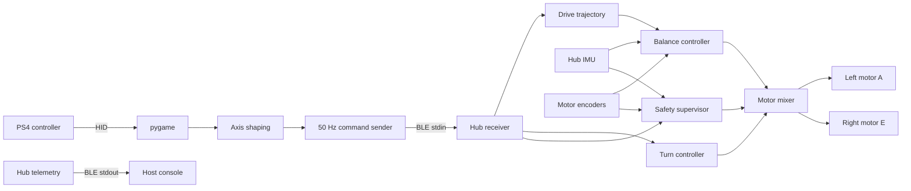
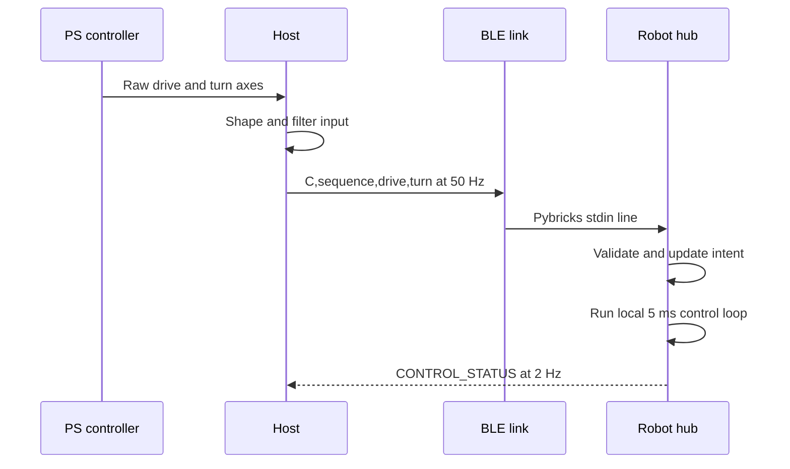

# PS-controlled self-balancing robot architecture

This document describes the standalone `apps/0v3p3` runtime architecture.
Component details are in [HOST_ARCHITECTURE.md](HOST_ARCHITECTURE.md) and
[HUB_ARCHITECTURE.md](HUB_ARCHITECTURE.md).

## System context

The solution is split across two independently executing systems:

- The **host** is a Mac running CPython, pygame, and pybricksdev. It reads the
  PlayStation controller, shapes joystick input, and sends normalized commands.
- The **robot** is a LEGO Robot Inventor 51515 hub running Pybricks. It owns all
  real-time control, motor output, calibration, safety checks, and command-loss
  behavior.

The host supplies intent, not motor power. The hub remains responsible for
balance even if Bluetooth traffic or the host process disappears.

## Deployment and startup

1. The host discovers and connects to a Pybricks hub over BLE.
2. It downloads `hub/balance_steering.py`, unless
   `--use-stored-program` selects the copy already on the hub.
3. The hub calibrates its IMU while checking orientation and wheel stillness.
4. The hub displays `R`, beeps, and announces `BALANCE_ACTIVE`.
5. Only then does the host send runtime limits and joystick commands.
6. The hub validates every message and applies commands in its 5 ms loop.

This ordering prevents command traffic accumulating during calibration.

## Runtime command path

Drive and turn are normalized to `[-1, 1]`:

- `drive` becomes a bounded wheel-position trajectory rate.
- `turn` becomes a differential motor-duty request, limited by speed and
  available balance authority.

## Ownership boundaries

| Concern | Host | Robot hub |
|---|---:|---:|
| Controller discovery and axis mapping | Yes | No |
| Joystick dead zone/filter/slew | Yes | No |
| BLE discovery and deployment | Yes | No |
| Message formatting | Yes | Validates |
| Runtime drive/turn limits | Requests | Validates/applies |
| IMU calibration | No | Yes |
| Balance feedback | No | Yes |
| Drive trajectory and braking | No | Yes |
| Steering and motor mixing | No | Yes |
| Watchdog and physical safety | No | Yes |
| Telemetry | Prints | Produces |

The central rule is that host timing is never required to keep the robot
upright. Command loss removes motion intent but does not stop balancing.

## Protocol summary

| Direction | Message | Meaning |
|---|---|---|
| Host → hub | `S,<drive_dps>,<turn_duty>` | Configure runtime limits |
| Host → hub | `C,<hex_seq>,<drive>,<turn>` | Sequenced normalized command |
| Hub → host | `BALANCE_ACTIVE,...` | Calibration complete |
| Hub → host | `CONTROL_STATUS,...` | Periodic controller telemetry |
| Hub → host | `WATCHDOG,commands_zeroed` | Command timeout |
| Hub → host | `BALANCE_STOPPED,reason=...` | Safety or operator stop |
| Hub → host | `BALANCE_EXIT` | Program cleanup complete |

The 16-bit sequence rejects duplicate, stale, and out-of-order commands across
wraparound.

## Safety and degraded operation

- **Host or BLE loss:** after 250 ms the hub zeros drive and turn; balance
  continues.
- **Host shutdown:** default cleanup disconnects without stopping the hub.
  `--stop-hub-on-exit` is the explicit maintenance override.
- **Controller disconnect:** the host attempts a zero command; the watchdog is
  the independent fallback.
- **Fall, high-speed lean, or runaway:** the hub stops motors and exits.
- **Neutral lift:** unloaded wheel acceleration stops the program rather than
  restarting in the operator's hands.
- **Physical stop:** the hub center button stops the program.

## Timing model

The hub loop targets 5 ms. Commands arrive at 50 Hz and telemetry is emitted at
2 Hz. BLE printing was observed to disturb the real-time loop, so telemetry is
deliberately sparse. Host command and telemetry rates are not control-loop rates;
balance always runs locally at the faster hub cadence.
