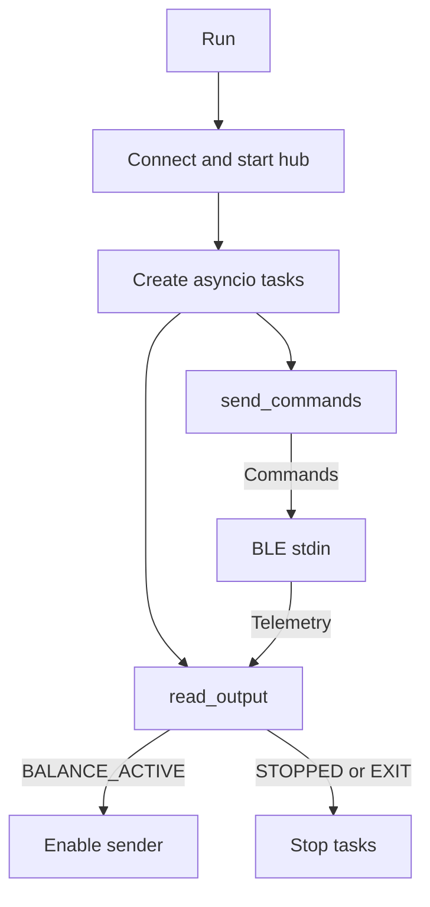

# Host architecture

The host translates PlayStation controller input into normalized motion intent
and transports it to the Pybricks hub. It does not calculate motor duty or
participate in the real-time balance feedback loop.

## Components

### Entry point

`controller.py` is the user-facing entry point and runtime orchestrator.

### Runtime orchestrator

`controller.py` owns:

- command-line parsing;
- pygame and joystick initialization;
- Pybricks BLE discovery and connection;
- hub program download/start;
- concurrent command sending and telemetry reading;
- host lifecycle and disconnect behavior.

After starting the hub, it creates two asynchronous tasks:



`read_output()` prints hub output and recognizes lifecycle messages.
`send_commands()` waits for `BALANCE_ACTIVE`, sends configuration once, then
sends commands at 50 Hz by default.

### Controller input processing

`control.py` is hardware-independent input shaping. Each axis has an
`AxisProcessor` pipeline:

1. Clamp input to `[-1, 1]`.
2. Remove and rescale an 8% symmetric dead zone.
3. Blend linear and cubic response with 35% exponential shaping.
4. Apply a first-order low-pass filter with alpha 0.25.
5. Limit change to 3 normalized units per second.

```text
raw axis
  -> dead zone
  -> exponential response
  -> low-pass filter
  -> slew limiter
  -> normalized command
```

The selected mapping is axis 1 (inverted) for drive and axis 2 for turn. Both
indices are configurable because SDL mappings vary.

### Protocol encoder

`protocol.py` emits:

```text
S,<max_drive_speed_dps>,<max_turn_duty>
C,<16-bit hex sequence>,<drive>,<turn>
```

Commands are clamped to `[-1, 1]` and formatted to two decimal places. Runtime
configuration rejects non-finite/non-positive drive limits and turn limits
outside `[0, 20]`.

The sequence increments modulo 65536. The half-range wraparound comparison
prevents older packets overwriting newer intent.

## Concurrency and timing

The host uses `asyncio` for BLE reads and writes. It is not a real-time
scheduler:

- command writes target 50 Hz;
- elapsed time uses `time.monotonic()`;
- filter `dt` is capped at 100 ms after a host stall;
- the hub watchdog is the final command-loss authority.

## Lifecycle behavior

### Normal start

1. Validate limits before opening hardware.
2. Require one pygame joystick.
3. Connect to the selected or first Pybricks hub.
4. Download the hub program unless `--use-stored-program` is set.
5. Wait for `BALANCE_ACTIVE`.
6. Send configuration and begin commands.

### Host exit

Default cleanup does not call `stop_user_program()`. It closes BLE and relies
on the hub watchdog to zero motion intent while balance continues.

`--stop-hub-on-exit` explicitly stops the program and is intended for
maintenance.

An uncatchable process kill cannot execute cleanup, but command traffic still
ends and the hub watchdog applies the same safe-zero behavior.

### Controller disconnect

The sender attempts one zero command and exits with an error. Cleanup disconnects
without stopping the hub. If the zero packet is lost, the watchdog still removes
motion intent.

## Diagnostics

- `controller_diag.py`: controller enumeration and axis mapping.
- `run_link.py` with `hub/link_test.py`: protocol/watchdog test without motors.
- `run_steering.py` with `hub/steering_test.py`: suspended-wheel polarity.
- `controller.py`: complete balance, drive, and steering application.

These tools isolate input, communications, and polarity failures before the
complete controller is used.

## Failure boundary

The host may safely fail by omission: missing commands become zero intent. It
must not be relied upon to deliver a final stop packet, maintain a precise
control period, or keep balance active. Those guarantees belong to the hub.
