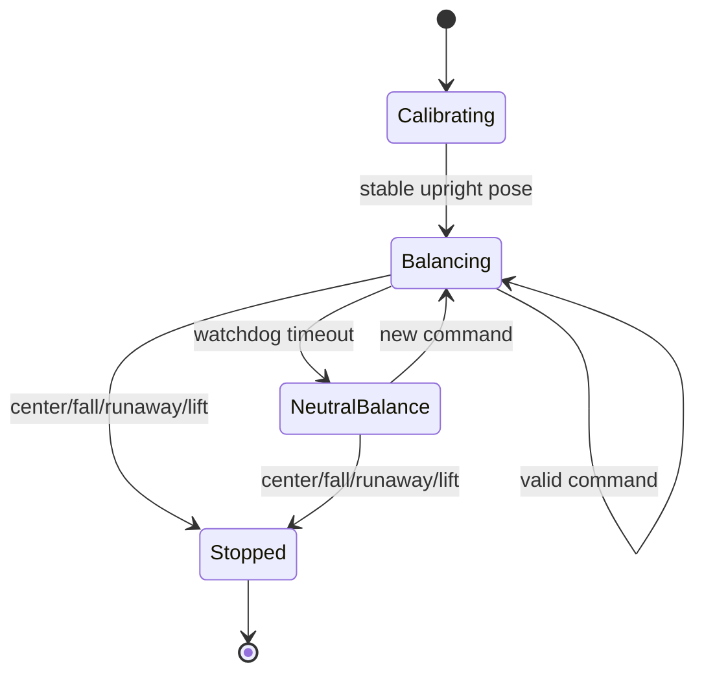

# Robot hub architecture

`hub/main.py` is the on-robot application. It combines startup
calibration, BLE command reception, trajectory generation, balance feedback,
steering allocation, motor output, telemetry, and safety supervision.

## Hardware mapping

| Device | Mapping |
|---|---|
| Left drive motor | Port A, logical sign −1 |
| Right drive motor | Port E, logical sign +1 |
| Balance gyro axis | IMU X angular velocity |
| Absolute correction | Second value from `imu.tilt()` |
| Stop button | Hub center button |
| Display orientation | `Side.LEFT` |

Opposite motor signs normalize both encoders into one forward position and map
common duty back into the correct physical wheel directions.

## Lifecycle



### Calibration

Calibration accepts 500 ms of samples only when:

- gyro X rate is within 5 degrees/second;
- wheel change is at most 3 degrees per 20 ms sample;
- accumulated wheel drift is at most 12 degrees;
- pitch is within 15 degrees of zero;
- roll is within 8 degrees of the observed 90-degree upright pose.

Average gyro rate becomes gyro bias. Average roll becomes the absolute upright
reference. The display shows `H` while waiting, then `R` and a beep when the
control loop begins.

## Command receiver

The nonblocking stdin receiver runs inside the main loop. It validates:

- field count and message type;
- numeric parsing and finite limits;
- normalized command bounds;
- runtime turn ceiling;
- wrapping sequence freshness;
- maximum input length.

Each accepted command updates `last_command_ms`. After 250 ms without a valid
command, drive and turn become zero while balancing continues.

## State estimation

### Body angle

The fast estimate integrates bias-corrected gyro rate:

```text
relative_angle += gyro_rate * 0.005
```

A complementary correction slowly pulls it toward absolute IMU tilt with a
5-second time constant. Gyro integration provides fast response; absolute tilt
limits long-term drift.

### Wheel position and speed

```text
position = (-left_angle + right_angle) / 2
```

Speed is the position difference across a 200 ms window. The window reduces
encoder noise but delays the estimate and contributes to transient overshoot.

## Drive controller

Drive input defines trajectory speed rather than motor duty:

```text
requested_speed = normalized_drive * max_drive_speed_dps
```

Reference behavior:

- acceleration is fixed at 600 degrees/second²;
- deceleration is speed-adaptive;
- reversal is blocked until measured and reference speeds approach zero.

Deceleration is 1800 degrees/second² near rest, falls linearly to 200 at 400
degrees/second, and remains 200 above that speed. This yields a long high-speed
coast and stronger final settling.

The reference is integrated into commanded wheel position:

```text
commanded_position += reference_speed * 0.005
```

Configured speed is therefore a moving-position trajectory rate, not a strict
wheel-speed setpoint. Measured speed can overshoot while momentum and position
error resolve.

## Balance controller

Common wheel duty uses four feedback terms:

```text
raw_duty =
    RATE_GAIN     * gyro_rate
  + ANGLE_GAIN    * body_angle
  + POSITION_GAIN * (measured_position - commanded_position)
  + SPEED_GAIN    * measured_speed
```

| Term | Gain | Purpose |
|---|---:|---|
| Angular rate | 0.018 | Damp rapid body rotation |
| Body angle | 19.0 | Move wheels under center of mass |
| Position error | 0.45 | Track trajectory and hold position |
| Wheel speed | 0.20 | Damp wheel motion |

Duty is compensated for battery voltage, receives low-speed motor-deadband
compensation, and is clamped to ±100%.

When braking ends, the target freezes while residual momentum remains. Position
and speed feedback can reverse duty several times while settling; this is the
known braking stutter in the current controller.

## Turn controller and motor mixer

```text
left  = left_sign  * (balance_duty + turn_duty)
right = right_sign * (balance_duty - turn_duty)
```

Steering limits depend on measured speed:

| Speed | Turn ceiling |
|---|---:|
| Below 500 dps | 20% |
| 500–699 dps | 10% |
| 700+ dps | 5% |

The limit is additionally capped by motor headroom:

```text
headroom = max(0, 100 - 5 reserve - abs(balance_duty))
effective_turn_limit = min(speed_limit, headroom)
```

Balance therefore has priority near motor saturation.

## Safety supervisor

| Condition | Action |
|---|---|
| Center button | Stop program |
| Absolute lean ≥12° | Stop: `fallen` |
| Speed ≥400 and lean ≥10.5° | Stop: `high_speed_angle` |
| Absolute speed ≥1200 dps | Stop: `runaway_speed` |
| Neutral/reference zero, speed ≥400 for 100 ms, lean ≤8° | Stop: `lifted` |
| No valid command for 250 ms | Zero intent; continue balance |

Terminal paths reach `finally`, which stops both motors and clears the display.
Lift detection only observes a fully neutral reference, so commanded travel or
unfinished braking cannot trigger it.

## Telemetry

`CONTROL_STATUS` is emitted at 2 Hz and includes:

- normalized/scaled drive and normalized turn;
- trajectory reference and adaptive deceleration;
- reversal state;
- effective turn limit and turn duty;
- measured/commanded position;
- measured speed and body angle;
- common balance duty;
- command age and watchdog state.

Telemetry is diagnostic and is not feedback.

## Real-time constraints

The loop targets 5 ms against an absolute stopwatch deadline. BLE output can
block, so telemetry is sparse and adaptive steering uses threshold comparisons.
Critical feedback, safety, and watchdog behavior are entirely local. When late,
the loop skips waiting and immediately begins the next iteration.
